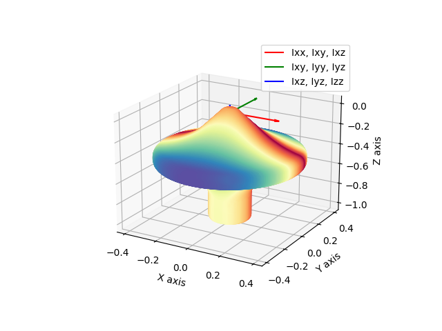
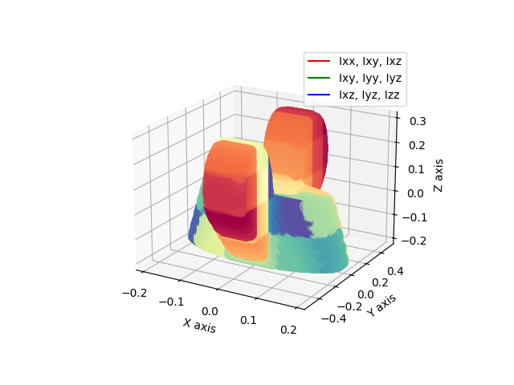

# Inertia Tensor Calculation and Visualization

This Python script calculates the inertia tensor of a 3D object based on provided coordinate data and visualizes the results in a 3D plot. The script is particularly useful for analyzing the rotational dynamics of objects like a spinning top or any other 3D shape with a defined pivot point.

<p float="left">
  
   
</p>

## Table of Contents
- [Installation](#installation)
- [Usage](#usage)
- [Script Details](#script-details)
- [Output](#output)
- [License](#license)

## Installation

To run this script, you need Python installed along with the following libraries:
- NumPy
- SymPy
- Matplotlib
- SciPy

You can install the required Python packages using pip:

```bash
pip install numpy sympy matplotlib scipy
```

## Usage

1. **Input Data**: The script expects a file named `djanibekov.txt` inside a `data` directory, containing 3D coordinates of the object. The coordinates should be in TXT format, with each row representing a point in 3D space. You can achieve this with Voxelizer of a 3d model.

2. **Viewing Results**: After running the script, a 3D plot will be displayed showing the object's orientation in space, along with its calculated inertia tensor vectors.

## Script Details

### Coordinate Transformation
- The script loads 3D coordinates from the `djanibekov.txt` file.
- The coordinates are transformed by swapping the y and z axes.
- The coordinate system is normalized and translated to center the object at the pivot point, which is assumed to be the topmost point along the z-axis for spinning top and center of mass for wing nut.

### Inertia Tensor Calculation
- The inertia tensor components (`Ixx`, `Iyy`, `Izz`, `Ixy`, `Iyz`, `Ixz`) are calculated using the transformed coordinates.

### Visualization
- The script generates a 3D scatter plot showing the object’s reduced coordinates for visualization efficiency.
- Vectors representing the inertia tensor’s principal axes are drawn from the origin.
- The plot includes labels for the X, Y, and Z axes, and a legend for the vectors.

## Output

- **3D Plot**: The script outputs a 3D plot displaying the reduced coordinates of the object and the principal axes of the inertia tensor.
- **Inertia Tensor Matrix**: The inertia tensor matrix is printed to the console.

Example Output:

```plaintext
[[Ixx, Ixy, Ixz],
 [Ixy, Iyy, Iyz],
 [Ixz, Iyz, Izz]]
```

